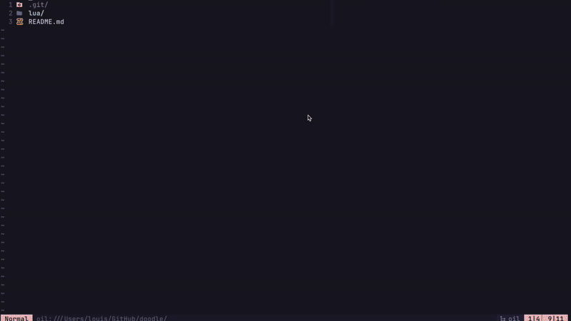

# doodle.nvim

_Neovim isin't all about productivity_



## Installation

### [lazy.nvim](https://github.com/folke/lazy.nvim)

```lua
{
  "louis-dj/doodle.nvim",
  config = function()
    require("doodle").setup({
        remap = "<leader>g" -- bring the canvas up
    })
  end
}
```


### [packer.nvim](https://github.com/wbthomason/packer.nvim)

```lua
use({
  "louis-dj/doodle.nvim",
  config = function()
    require("doodle").setup({
        remap = "<leader>g" -- bring the canvas up
    })
  end
})
```
